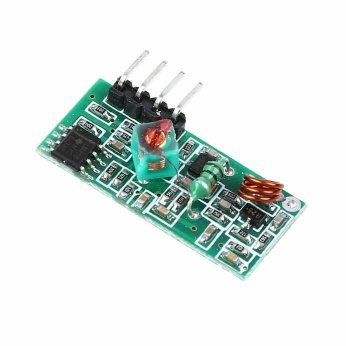

# Arduino 433MHz decoder for Nexus outdoor sensor

Simple arduino sketch to decode 433 signals from a Nexus-TH outdoor sensor. 
Nexus-TH is a modulation protocol for temperature/humidity sensors. 
Sketch can be easy adapted to similar protocols. 

The sketch uses no libraries. The 433 receiver is connected to datapin D2 of NodeMcu. Modulation protocol: OOK_PULSE_PPM.

Tested on NodeMcu ESP8266 board with a cheap XY-MK-5V super regenerative receiver.

Output to serial monitor.

Example of brands that uses Nexus-TH protocol: Alecto (WS-1050), FreeTec (NC-7345, NX-3980), Technoline, Solight (TE82S), TFA (30.3209).

Most of these outdoor sensors have no logging for long periods.

I used this sketch to log the outdoor temperature of my Alecto WS-1050.
